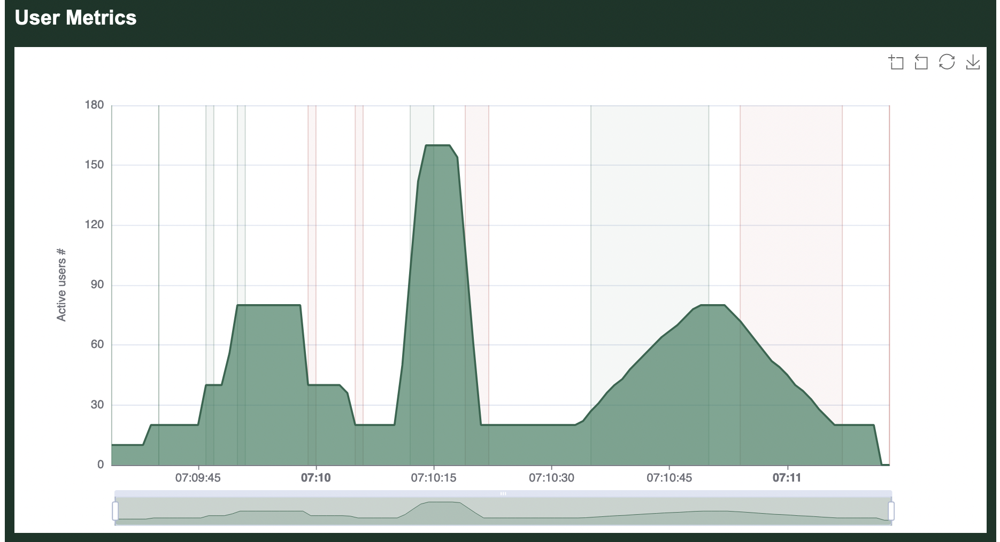

# Telnet Controller

The host and port that the telnet Controller listens on can be configured at start time with `--telnet-host` and `--telnet-port`. The telnet Controller can be completely disabled with the `--no-telnet` command line option. The defaults can be changed with [`GooseDefault::TelnetHost`](https://docs.rs/goose/*/goose/config/enum.GooseDefault.html#variant.TelnetHost),[`GooseDefault::TelnetPort`](https://docs.rs/goose/*/goose/config/enum.GooseDefault.html#variant.TelnetPort), and [`GooseDefault::NoTelnet`](https://docs.rs/goose/*/goose/config/enum.GooseDefault.html#variant.NoTelnet).

## Controller Commands

To learn about all available commands, telnet into the Controller thread and enter `help` (or `?`). For example:
```bash
% telnet localhost 5116
Trying 127.0.0.1...
Connected to localhost.
Escape character is '^]'.
goose> ?
goose 0.16.1 controller commands:
help               this help
exit               exit controller

start              start an idle load test
stop               stop a running load test and return to idle state
shutdown           shutdown load test and exit controller

host HOST          set host to load test, (ie https://web.site/)
hatchrate FLOAT    set per-second rate users hatch
startup-time TIME  set total time to take starting users
users INT          set number of simulated users
runtime TIME       set how long to run test, (ie 1h30m5s)
test-plan PLAN     define or replace test-plan, (ie 10,5m;10,1h;0,30s)

config             display load test configuration
config-json        display load test configuration in json format
metrics            display metrics for current load test
metrics-json       display metrics for current load test in json format
goose> q
goodbye!
goose> Connection closed by foreign host.
```

## Example

One possible use-case for the controller is to dynamically reconfigure the number of users being simulated by the load test. In the following example, the load test was launched with the following parameters:

```bash
% cargo run --release --example umami -- --no-autostart --host https://umami.ddev.site/ --hatch-rate 50 --report-file report.html
```

Then the telnet controller is invoked as follows:
```bash
% telnet loadtest 5116
Trying loadtest...
Connected to loadtest.
Escape character is '^]'.
goose> start 
load test started
goose> users 20
users configured
goose> users 40
users configured
goose> users 80
users configured
goose> users 40 
users configured
goose> users 20
users configured
goose> users 160
users configured
goose> users 20
users configured
goose> hatch_rate 5
hatch_rate configured
goose> users 80
users configured
goose> users 20
users configured
goose> shutdown
load test shut down
goose> Connection closed by foreign host.
```

Initially the load test is configured with a hatch rate of 50, so goose increases and decreases the user count by 50 user threads per second. Later we reconfigure the hatch rate to 5, slowing down the rate that goose alters the number of user threads. The result is more clearly illustrated in the following graph generated at the end of the above example load test:



The above commands are also summarized in the metrics overview:

```
 === OVERVIEW ===
 ------------------------------------------------------------------------------
 Action       Started               Stopped             Elapsed    Users
 ------------------------------------------------------------------------------
 Increasing:  2022-05-05 07:09:34 - 2022-05-05 07:09:34 (00:00:00, 0 -> 10)
 Maintaining: 2022-05-05 07:09:34 - 2022-05-05 07:09:40 (00:00:06, 10)
 Increasing:  2022-05-05 07:09:40 - 2022-05-05 07:09:40 (00:00:00, 10 -> 20)
 Maintaining: 2022-05-05 07:09:40 - 2022-05-05 07:09:46 (00:00:06, 20)
 Increasing:  2022-05-05 07:09:46 - 2022-05-05 07:09:47 (00:00:01, 20 -> 40)
 Maintaining: 2022-05-05 07:09:47 - 2022-05-05 07:09:50 (00:00:03, 40)
 Increasing:  2022-05-05 07:09:50 - 2022-05-05 07:09:51 (00:00:01, 40 -> 80)
 Maintaining: 2022-05-05 07:09:51 - 2022-05-05 07:09:59 (00:00:08, 80)
 Decreasing:  2022-05-05 07:09:59 - 2022-05-05 07:10:00 (00:00:01, 40 <- 80)
 Maintaining: 2022-05-05 07:10:00 - 2022-05-05 07:10:05 (00:00:05, 40)
 Decreasing:  2022-05-05 07:10:05 - 2022-05-05 07:10:06 (00:00:01, 20 <- 40)
 Maintaining: 2022-05-05 07:10:06 - 2022-05-05 07:10:12 (00:00:06, 20)
 Increasing:  2022-05-05 07:10:12 - 2022-05-05 07:10:15 (00:00:03, 20 -> 160)
 Maintaining: 2022-05-05 07:10:15 - 2022-05-05 07:10:19 (00:00:04, 160)
 Decreasing:  2022-05-05 07:10:19 - 2022-05-05 07:10:22 (00:00:03, 20 <- 160)
 Maintaining: 2022-05-05 07:10:22 - 2022-05-05 07:10:35 (00:00:13, 20)
 Increasing:  2022-05-05 07:10:35 - 2022-05-05 07:10:50 (00:00:15, 20 -> 80)
 Maintaining: 2022-05-05 07:10:50 - 2022-05-05 07:10:54 (00:00:04, 80)
 Decreasing:  2022-05-05 07:10:54 - 2022-05-05 07:11:07 (00:00:13, 20 <- 80)
 Maintaining: 2022-05-05 07:11:07 - 2022-05-05 07:11:13 (00:00:06, 20)
 Canceling:   2022-05-05 07:11:13 - 2022-05-05 07:11:13 (00:00:00, 0 <- 20)

 Target host: https://umami.ddev.site/
 goose v0.16.1
 ------------------------------------------------------------------------------
```
