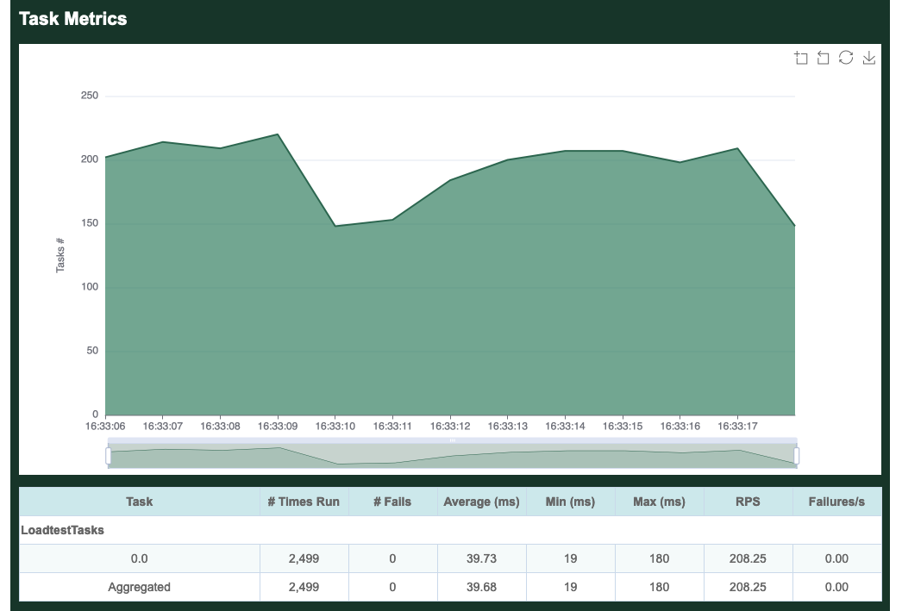

# Running A Load Test

We will use Cargo to run our example load test application. It's best to get in the habit of setting the `--release` option whenever compiling or running load tests.

```bash
$ cargo run --release
    Finished release [optimized] target(s) in 0.23s
     Running `target/release/loadtest`
Error: InvalidOption { option: "--host", value: "", detail: "A host must be defined via the --host option, the GooseAttack.set_default() function, or the GooseTaskSet.set_host() function (no host defined for LoadtestTasks)." }
```

The load test fails with an error as it hasn't been told the host you want to load test. So, let's try again, this time passing in the `--host` flag. We will also add `--report-file` flag, which will generate a HTML report. Same information will also [be printed to the command line](metrics.md) (without graphs). After running for a few seconds, press `ctrl-c` to stop the load test:

```bash
$ cargo run --release -- --host https://drupal-memcache.ddev.site --report-file=report.html
    Finished release [optimized] target(s) in 0.17s
     Running `target/release/goose_attack --host 'https://drupal-memcache.ddev.site' --report-file=report.html`

// Some output omitted...
```

The HTML report will include a few sections. Let's go through them: 


By default, Goose will hatch 1 `GooseUser` per second, up to the number of CPU cores available on the server used for load testing. In the above example, the server has 8 CPU cores, so it took 8 seconds to hatch all users. After all users are hatched, Goose flushes all metrics collected during the hatching process (use `--no-reset-metrics` to disable this behavior) so all subsequent metrics are taken with all users running. Before flushing the metrics, they are displayed to the console so the data is not lost.

The same metrics are displayed per-task and per-request. In our simple example, our single task only makes one request, so in this case both metrics show the same results.


The per-request metrics are displayed first. Our single task makes a `GET` request for the `/` path, so it shows up in the metrics as `GET /`. The table in this section displays shows the total number of requests made (2,499),the average number of requests per second (208.25), and the average number of failed requests per second (0). 

Additionally is shows the average time required to load a page (39.68 milliseconds), the minimum time to load a page (19 ms) and the maximum time to load a page (180 ms).


The second section displays the average time required to load a page. The table in this section is showing the slowest page load time for a range of percentiles. In our example, in the 50% fastest page loads, the slowest page loaded in 36 ms. In the 70% fastest page loads, the slowest page loaded in 41 ms, etc.



Next comes per-task metrics, starting with the name of our Task Set, `LoadtestTasks`. Individual tasks in the Task Set are then listed in the order they are defined in our load test. We did not name our task, so it simply shows up as `0.0`. All defined tasks will be listed here, even if they did not run, so this can be useful to confirm everything in your load test is running as expected. Comparing the tasks metrics metrics collected for `0.0` to the per-request metrics collected for `GET /`, you can see that they are the same.

In real load tests, you'll most likely have multiple task sets each with multiple tasks, and Goose will show you metrics for each along with an aggregate of them all together.

Refer to the [examples](../example/overview.html) included with Goose for more complicated and useful load test examples.
