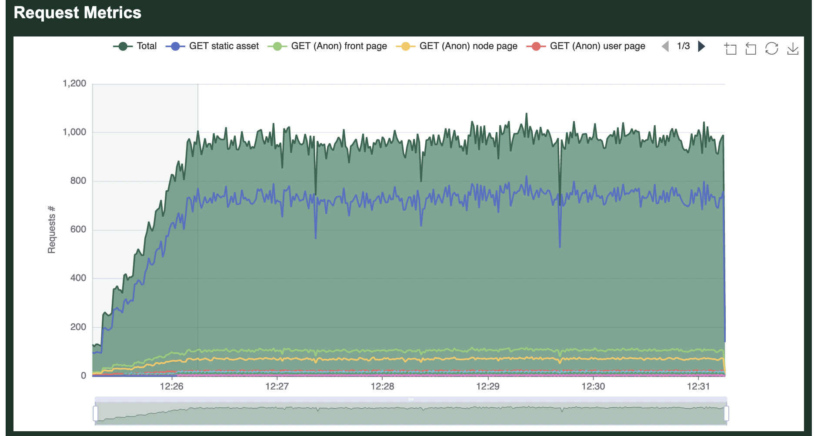
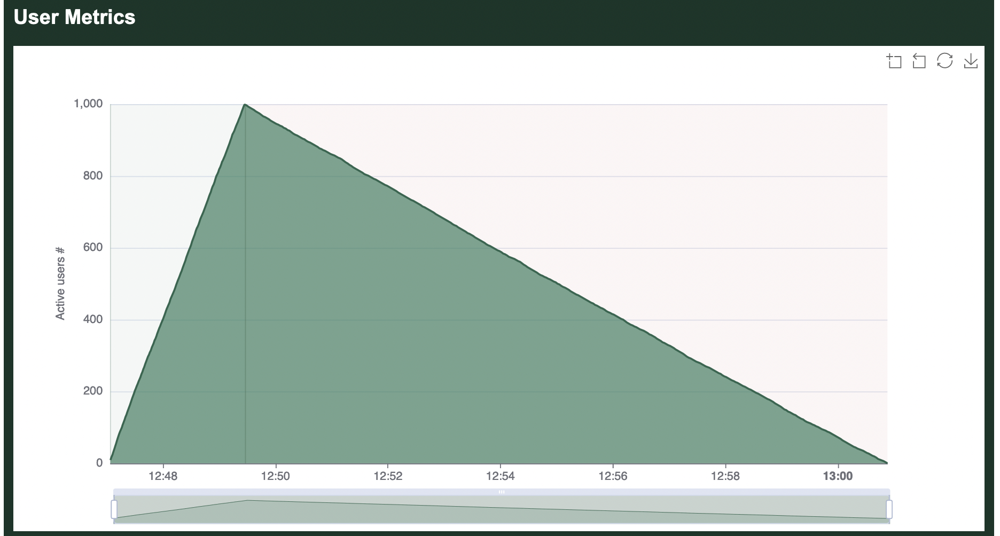
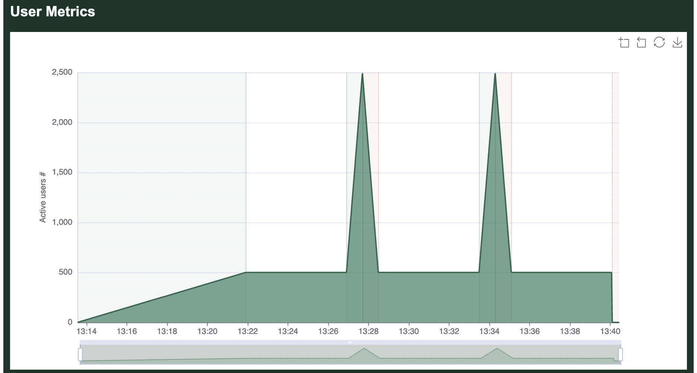

# Test Plan

A load test that ramps up to full strength and then runs for a set amount of time can be configured by combining the `--startup-time` or `--hatch-rate` options together with the `--users` and `--run-time` options. For more complex load patterns you must instead use the `--test-plan` option.

A test plan is defined as a series of numerical pairs that each defines a number of users, and a number of seconds to ramp to this number of users. For example, "10,60" means "launch 10 users over 60 seconds". By stringing together multiple pairs separated by a semicolon you can define more complex test plans. For example, "10,1m;10,5m;0,0" means "launch 10 users over 1 minute, continue with 10 users for 5 minutes, then shut down the load test as quickly as possible".

## Simple Example

The following command tells Goose to start 10 users over 60 seconds and then to run for 5 minutes before shutting down:

```bash
$ cargo run --release -- -H http://local.dev/ --startup-time 1m --users 10 --run-time 5m --no-reset-metrics
```

The exact same behaviour can be defined with the following test plan:

```bash
$ cargo run --release -- -H http://local.dev/ --test-plan "10,1m;10,5m;0,0"
```



## Ramp Down Example

Goose will stop a load test as quickly as it can when the specified `--run-time` completes. To instead configure a load test to ramp down slowly you can use a test plan. In the following example, Goose starts 1000 users in 2 minutes and then slowly stops them over 500 seconds (stopping 2 users per second):

```bash
$ cargo run --release -- -H http://local.dev/ --test-plan "1000,2m;0,500"
```



## Load Spike Example

Another possibility when specifying a test plan is to add load spikes into otherwise steady load. For example, in the following example Goose starts 500 users over 5 minutes and lets it run with a couple of traffic spikes to 2,500 users:

```bash
$ cargo run --release -- -H http://local.dev/ --test-plan "500,5m;500,5m;2500,45;500,45;500,5m;2500,45;500,45;500,5m;0,0"
```



## Internals

Internally, Goose converts the test plan into a vector of usize tuples, `Vec<(usize, usize)>`, where the first integer reflects the number of users to be running and the second integer reflects the time in milliseconds. You can see the internal representation when you start a load test, for example:

```bash
% cargo run --release --example simple -- --no-autostart --test-plan "100,30;100,1h" | grep test_plan
13:54:35 [INFO] test_plan = GooseTestPlan { test_plan: [(100, 30000), (100, 3600000)] }
```
